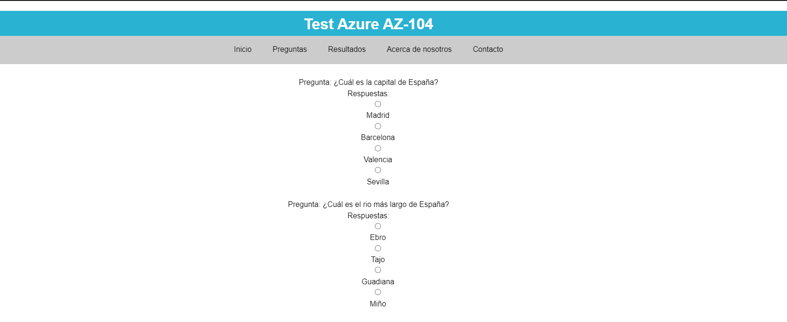

# Test with JSON

This project is a practice to work on my HTML, CSS, and JavaScript skills. Including loading data from a JSON file.

## Table of contents

- [Overview](#overview)
  - [Screenshot](#screenshot)
  - [Links](#links)
- [My process](#my-process)
  - [Built with](#built-with)
  - [What I learned](#what-i-learned)
  - [Useful resources](#useful-resources)
- [Author](#author)
- [Acknowledgments](#acknowledgments)

## Overview

### Screenshot



### Links

- Live Site URL: [https://azure-test-npeppz8kd-jaimedargallo.vercel.app](https://azure-test-npeppz8kd-jaimedargallo.vercel.app)
- Project in codepen: [https://codepen.io/jaimedargallo/](https://codepen.io/jaimedargallo/pen/vYvzrjw)

## My process

### Built with

- Semantic HTML5 markup
- Flexbox
- Mobile-first workflow

### What I learned

In this proyect I learn about:

Using semantic HTML5 markup would have taught the importance of creating structured and meaningful content that search engines and screen readers can easily interpret.

How to create flexible layouts that can adapt to different screen sizes and devices. I would have also learned how to control the alignment and distribution of content within the layout.

Adopting a mobile-first workflow would have taught I how to prioritize mobile devices when designing your project. This approach would have helped I create a responsive design that looks great on both small and large screens.
The importance of using media queries to adjust the layout based on the device's screen size.

To see how you can add code snippets, see below:

```html

```

```css

```

### Useful resources

- [Trabajando con JSON](https://developer.mozilla.org/es/docs/Learn/JavaScript/Objects/JSON) - The place where I learn to start with JSON.

## Author

- [Twitter](https://twitter.com/jaimedargallo)
- [Github](https://github.com/jaimedargallo)
- [Codepen](https://codepen.io/jaimedargallo)
- [Frontend Mentor](https://www.frontendmentor.io/profile/jaimedargallo)


## Acknowledgments
